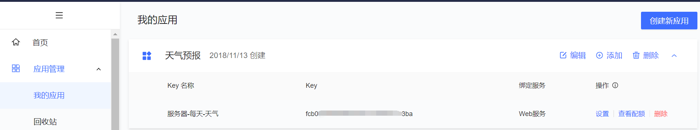

## weather

这个是早期做的一个关于发送天气预报的小项目，主要有三个技术点：

- 如何获取天气信息
- 如何通过邮件发送消息
- 定时任务

### 获取天气的api

比较百度地图和高德地图，百度地图的天气接口已经取消，[高德地图](https://lbs.amap.com/api/webservice/guide/api/weatherinfo)的使用也较为简单。

先申请应用和应用的key



天气查询API服务地址：

```shell
https://restapi.amap.com/v3/weather/weatherInfo?parameters
```

**请求参数**

| 参数名     | 含义             | 规则说明                                                     | 是否必须 | 缺省值 |
| ---------- | ---------------- | ------------------------------------------------------------ | -------- | ------ |
| key        | 请求服务权限标识 | 用户在高德地图官网[申请web服务API类型KEY](https://lbs.amap.com/dev/) | 必填     | 无     |
| city       | 城市编码         | 输入城市的adcode，adcode信息可参考[城市编码表](https://lbs.amap.com/api/webservice/download) | 必填     | 无     |
| extensions | 气象类型         | 可选值：base/all                                             | 可选     | 无     |
| output     | 返回格式         | 可选值：JSON,XML                                             | 可选     | JSON   |

